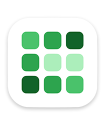
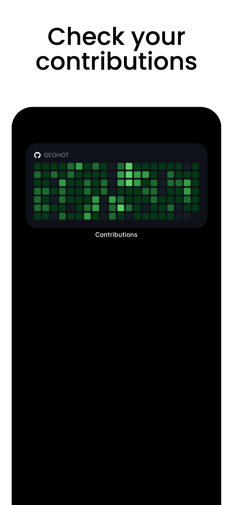
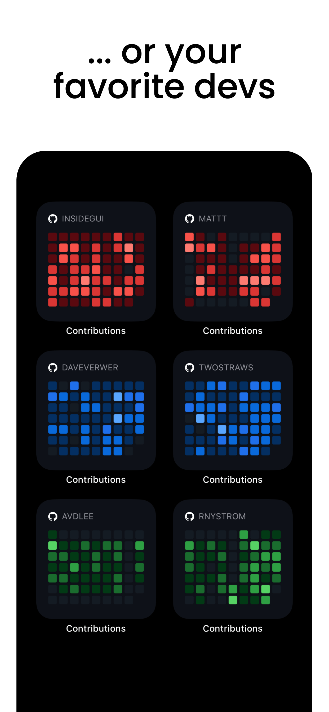

# GitHub Contribution Graphs for iOS

Stay on top of your GitHub contributions, right from your iOS Home Screen.

- View your GitHub contributions directly in a widget
- Pick the widget size that works best for you
- Customize colors with multiple themes

## Screenshots

 

## Requirements

- iOS 16.6+
- Xcode 26.0+

## Contributing

If you have feature requests or bug reports, feel free to send pull requests or [open an issue](https://github.com/AnderGoig/github-contributions-ios/issues/new).
Please check out the [CONTRIBUTING](CONTRIBUTING.md) guide before contributing.

## Credits

"Contribution Graphs for GitHub" is brought to you by [Ander Goig](https://github.com/AnderGoig) and [contributors to the project](https://github.com/AnderGoig/github-contributions-ios/contributors).

### Third-Party Libraries

- [Kingfisher](https://github.com/onevcat/Kingfisher) by [@onevcat](https://github.com/onevcat)
- [SwiftSoup](https://github.com/scinfu/SwiftSoup) by [@scinfu](https://github.com/scinfu)

## License

This project is released under the MIT license. See [LICENSE](LICENSE) for details.
