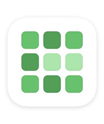

# GitHub Contribution Graphs for iOS

 

Quickly check in on your GitHub contributions from your iOS Home Screen!

- Select the Widget size that suits you better
- Type your GitHub username
- Choose between different color themes

## Screenshots

 
